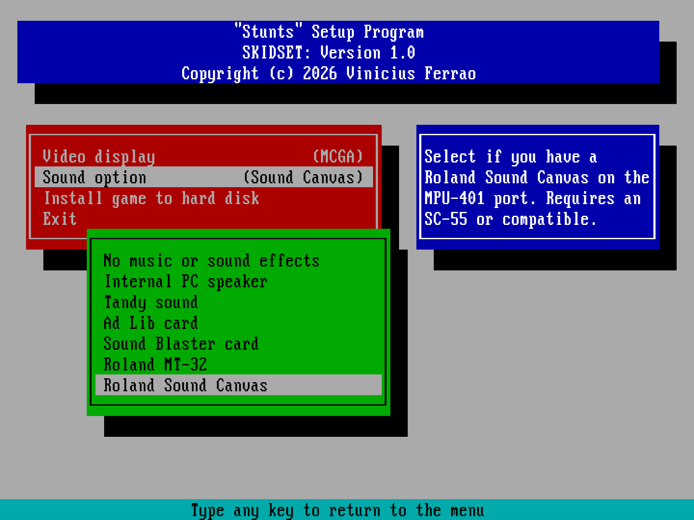

# skidset

Setup program for the Stunts / 4D Sports Driving MS-DOS game from 1990, and a
drop-in replacement for the `SETUP.EXE`.

## Use

Copy `SKIDSET.EXE` into the game directory and run it.

    SKIDSET.EXE [option]

With no options given, it behaves just like the original `SETUP.EXE`. However
it supports additional command line arguments for specific controls:

    /D   list the drivers found, and any block that was not used
    /I   install SKIDSET in place of SETUP.EXE
    /U   uninstall SKIDSET and restore the original SETUP.EXE program
    /V   show the version
    /?   show this help

Only `SKIDSET.EXE` takes `SETUP.EXE`'s name. It is the 16-bit build and runs
anywhere the game does, which is the whole point of installing at all.
`SKIDST32.EXE` refuses: it would leave a directory needing a 386 to configure
a game that runs on an 8086. Run either one directly whenever you like, and
`/U` works from either.

## What it offers

`skidset` is an extended implementation of the setup program that adds some
additional features. Like:

* Compatibility with the original `SETUP.DAT` configuration file.
* Peaceful coexistence with original `SETUP.EXE` if needed.
* A row appears only when the driver behind it is really on the disk.
* Support for driver removal, including shipped ones.
* Expanded driver support through a self-describing driver mechanism.

## Extending with an additional driver

Just drop compliant drivers in the game directory and it should just work.

The custom crafted drivers should comply with the format metadata we
developed so it can be consumed by `skidset`. The specification is trivial
and described as an example:

    SKIDSETDRV01
    sound
    label Roland Sound Canvas
    brief Sound Canvas
    help Select if you have a Roland Sound Canvas on the MPU-401 port.
    help Requires an SC-55 or compatible.
    SKIDSETEND

This format is governed by [DRVBLOCK.md](DRVBLOCK.md). Documentation is
available for anyone wanting to write a driver that will be compatible with
`skidset`.

## Build

If you want to build the software yourself, we provide a batch file per tested
compiler and a `makefile` for Unix-like systems. Working on the code rather
than using it? See [DEVELOP.md](DEVELOP.md).

### Unix

    make

Any C89 compiler. `CC` and `CFLAGS` override the defaults.

### DOS

    MSCBUILD          Microsoft C 5.10, 16-bit, large model
    TCBUILD           Turbo C 2.01, 16-bit, large model
    WCLBUILD          Open Watcom 1.9, 16-bit
    WCLBUILD 386      Open Watcom 1.9, 32-bit, extender built in

Set `MSCDIR`, `TCDIR` or `WATCOM` to your installation. If unset, the script
looks for the compiler in the default location.

### Windows

    WCLBUILD WIN32    Open Watcom 1.9, Win32 console

Produces `SKIDSTW.EXE`, which a release ships as `skidset.exe`. Run it from the
command prompt. It uses the console API Win32 has had since the beginning, so
it ought to run on anything back to Windows 95, but the oldest Windows it has
actually been run on is Windows 11. Take the older ones as untested rather
than supported.

Any modern toolchain should work with the Makefile. Example with MinGW-w64:

    mingw32-make CC=gcc

## Testing

    make selfcheck

The test suite writes and reads back every combination of the two available
menus and compares two of them byte for byte against files a retail Stunts /
4D Sports Driving shipped, reads driver blocks for both good and malformed,
and also checks that every text in the interface fits the window it opens in.

## Credits

- [restunts](https://github.com/4d-stunts/restunts), for the decompilation of
  the game: knowledge source and where we could guess the original toolchain.

## Acknowledgements

A massive thanks to all the members of the [ZakStunts](https://zak.stunts.hu)
community and the [Stunts Forum](https://forum.stunts.hu), who made all those
modifications. Without them there would be no reason to develop `skidset`.

## Licence

MIT. See [LICENSE](LICENSE).

### Third-party software

`SKIDST32.EXE` has the DOS/32A extender linked into it as its stub, which is
what lets one file run on a 386 with nothing else installed.

This product uses DOS/32 Advanced DOS Extender technology.

Its copyright notice, conditions and disclaimer are in `DOS32A.TXT`, which
ships inside the DOS archive. `SKIDSET.EXE` and the Win32 build do not
include it.
